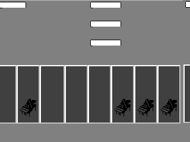
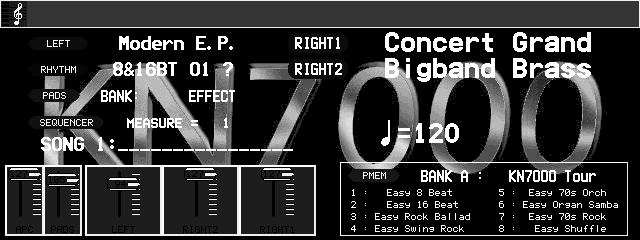

# KN2400/KN2600 — what the undumped table ROM is actually asked for

*2026-08-15. Rig: `tools/rigs/kn24_tableshape.lua`, run as
`TAP_UNTIL=30 ./tools/rig.sh kn24_tableshape kn2400 -s 32`. Deterministic — two runs gave
identical totals, widths and block counts.*

## Background

The KN2400 and KN2600 render almost nothing: `gate.sh` floors them at `distinct=4`, against
12–20 for every other model, and that floor is recorded as *a known defect, not a healthy
baseline*. The visible symptom (screenshot, 2026-08-14) is specific — **icons draw correctly**
(the grand-piano glyphs in the part cells are clean) while **every run of text renders as a
solid black bar**. So the blitter and compositor work; each glyph comes back fully set.

The driver declares `0x48000000-0x483FFFFF` as `ROMREGION_ERASEFF` because no such chip is
dumped for this family, and all-`0xFF` glyph data draws as a filled cell — exactly the symptom.
`kn24_fontsrc.lua` confirmed the region *is* read: 164,300 reads starting t=0.84 s. (An earlier
note in `kn2400-boot.md` said the firmware reads nothing from that range; that tap covered
**boot only**, and was superseded.)

This note answers the next question — *what shape of data does it expect?* — because that is
the part that survives: nobody can dump this ROM today, but the access pattern is a **test a
candidate dump can be checked against** when one appears.

## Measured

| | |
|---|---|
| total reads | **164,300** |
| when | **t=0 … t=6 only.** `0:60562  1:452  2:94942  5:42  6:8302`, then **nothing** for the remaining 24 s |
| share landing in the first `0x40` bytes | **67.6 %** |
| access widths | 1-byte **67,969** · 2-byte **37,160** · 4-byte **59,171** |
| distinct 256 B blocks touched | **113** (≈29 KB of a 4 MB region) |
| block discovery order | strictly ascending: `+0x0 +0x100 +0x200 +0x300 … +0xB00` |

Hottest individual addresses, all 4-byte aligned inside the first `0x40`:

```
+0x014  23392      +0x01C   8616
+0x020  19484      +0x024   4354
+0x018  11004      +0x010   4264
+0x00C  10906      +0x040   3834
+0x000   9720      +0x004   3765
```

## What this supports

1. **There is a descriptor in the first `0x40` bytes** — roughly sixteen 32-bit fields, consulted
   constantly (two thirds of all traffic) while the firmware walks entries. The mixed 1/2/4-byte
   widths fit a structure of dword pointers/lengths alongside byte-wide payload.
2. **The load is bounded and happens at boot.** It stops at t=6 and never resumes.
3. **Therefore text drawing does not fetch from this ROM.** At t=25 the play screen is up and
   drawing black bars, and in that whole window there is not one read of the region. Whatever
   the firmware wanted, it took once, early, into RAM — and the bars are drawn from that copy.

That third point is new, and it changes where to look.

## What this does NOT support

⚠ **The addresses walked beyond the header are artefacts.** The descriptor reads back as all
`0xFF`, so every pointer and length the firmware derives from it is garbage — the 113 blocks and
the tidy ascending order are what an all-`0xFF` descriptor produces, not evidence about the real
chip's layout. Only ~29 KB of a 4 MB region is touched, and that number is a property of the
missing data, not of the ROM.

The solid findings are the ones that do not depend on the contents: *there is a header at offset
0, it is about `0x40` bytes of dword fields, it is read before anything else, and the whole
transaction is over by t=6.*

## The copy loop, found and verified (same day)

The "RAM copy" above was inference when first written. It is now located, disassembled and
its output measured. Rig: `tools/rigs/kn24_tabledest.lua`.

```
4860c25e: mov   (0x500d7398), d1     ; destination base, from RAM
4860c265: mov   0x2c8, d0            ; 712 = record stride
4860c26a: mulu  d0, d2               ; d2 = record index * 712
4860c26c: add   0x10, d1             ; records start at base+0x10
4860c26e: add   d2, d1
4860c26f: mov   d1, a1
4860c271: mov   -0x164, d1           ; 356 halfwords = 712 bytes
4860c274: setlb                      ; hardware loop
4860c275: movhu (a0), d0             ; ★ read  from the table ROM
4860c277: add   2, a0
4860c279: movhu d0, (a1)             ; ★ write to RAM
4860c27b: add   2, a1
4860c27d: inc   d1
4860c27e: lne
...
4860c282: cmp   0x28, d3             ; 40 records
4860c284: blt   0x4860c258
```

Every number in that listing was then confirmed at runtime, independently:

| predicted from the disassembly | measured |
|---|---|
| destination = `[0x500D7398] + 0x10` | pointer reads `0x502A5014` → **`0x502A5024`**, and the write tap's lowest destination is **`0x502A5024`** |
| 40 records × 712 B = 28,480 B | **28,480 writes**, span `0x502A5024..0x502ABF60` |
| source is the all-`0xFF` table ROM | destination sampled after the copy: **99.86 % `0xFF`** |

That closes the chain end to end: **undumped ROM → `ROMREGION_ERASEFF` → a 28 KB RAM buffer
of 40 fixed-size records that is essentially all `0xFF`.**

A second, partly-affected buffer sits at `0x502AC108..0x502B0808` (~18 KB, **67.6 % `0xFF`**),
filled by three sibling loops at `0x4860C05D`, `0x4860C0AC` and `0x4860C130`.

⚠ **One attribution was rejected by measuring it.** The readers at `0x486FA939-0x486FA979`
matched a RAM writer 64 bytes away, which would have credited them with a 118 KB buffer at
`0x5038DCE0..0x503AAA84`. That buffer is **0.00 % `0xFF`** and 91 % zero, so it is not
table-ROM data and those reads feed something else. The content check exists precisely to
catch this; without it the write-up would have claimed 118 KB of damage that is not there.

## Tested: these buffers are NOT what draws the black bars

The obvious next inference — *the buffer is `0xFF`, the glyph cells draw solid, therefore the
buffer is the glyph source* — was tested and **does not hold**. Rig:
`tools/rigs/kn24_bufferpoke.lua`, comparing full-frame PNG snapshots between runs.

| run | frame vs control |
|---|---|
| buffer 1 `0x502A5024..0x502ABF63` (28,480 B) overwritten with `0x00` | **bit-identical** |
| buffer 2 `0x502AC108..0x502B0808` (18,177 B) overwritten with `0x00` | **bit-identical** |
| **positive control** — the framebuffer at `0x9C800000` overwritten with `0xFF` | **differs** ✓ |

The screenshot confirms the bars are genuinely on screen and would be sampled: four solid
black rectangles where text belongs, beside cleanly-drawn grand-piano icons in the part cells.
So the test had something to see, the method demonstrably reaches the display, and the answer
is negative.

### Getting the timing right was the entire experiment

The first two attempts poked at t=20 and t=7 and both returned "no change" — **and both were
worthless**. `tools/rigs/kn24_fbwrites.lua` measured why:

```
FB writes=67201 first=0.25s last=11.13s
FB per second -- 0:38400 2:9600 6:19200 11:1
```

The KN2400 composites its screen at **t=6** (19,200 bytes = exactly the full 320×240 2bpp
buffer) and never repaints after t=11.13. A poke at t=7 is already too late: the screen on
display was drawn before it, so *no* buffer could have shown an effect. The valid test holds
the buffer overwritten *across* the paint — here 45 repeated pokes spanning t=4…9 — and only
that version is evidence.

This is the same trap as the positive control passing for the wrong reason: poking the
framebuffer "worked" precisely because it skips the drawing step, and its persistence from
t=22 to t=30 is what revealed that nothing ever redraws.

### So where do the glyphs come from? Not the table ROM.

Asked and answered. `tools/rigs/kn24_fbwrites.lua` names the compositor and
`tools/rigs/kn24_glyphsrc.lua` taps every mapped region, recording only reads made from
inside the compositor's own code.

The compositor is at `0x485EC9D6`:

```
485ec993: movbu (a2), d0     ; ★ the pixel source
...
485ec9ab: call  0x486053f5   ; per-pixel lookup/convert
485ec9b2: lsr   6, d0
485ec9b5: and   0x03, d0     ; a 2-bit pixel
...
485ec9d6: movhu d1, (a0)     ; ★ the framebuffer write
485ec9e3: cmp   0x28, d0     ; 40 halfwords = 80 B = one 320px 2bpp scanline
485ec9f6: cmp   0xf0, d0     ; 240 rows
```

Its geometry matches the panel exactly, so this is unambiguously the routine that paints what
is on screen. What it reads:

| region | reads by the compositor |
|---|---|
| **`0x48000000` table ROM (undumped)** | **0** |
| `0x50000000` work RAM | **550,901** — `0x500063D8..0x5039B808` |
| libram, libram alias, work-RAM alias, LCD buffer | 0 |

**The compositor never touches the undumped table ROM.** Its input is work RAM, concentrated
in a hot bucket at `0x5039B700` (90,006 reads) and an even cluster around
`0x500B1A00..0x500B2400` (1,536 reads per 256 B bucket) — and *none* of those addresses are
the table-ROM copy destinations (`0x502A5024`, `0x502AC108`) found earlier. That is consistent
with, and independent of, the poke result.

⚠ **One artefact, named so it is not rediscovered as a finding.** The first run of this rig
reported 9,851,799 "reads" of the program ROM at `0x485EC954..0x485ECA00`. That is the
compositor's own **instruction fetch** — the PC filter window lies inside the program ROM, so
the routine was catching itself executing. The rig now skips reads whose address falls inside
the PC window. The work-RAM figures were never affected.

### What this means for the black bars

The chain "undumped table ROM → `0xFF` → solid glyph cells" is **not supported**. Two
independent measurements now say so: overwriting the table-ROM-derived buffers changes
nothing on screen, and the routine that actually paints the screen never reads that ROM.

The `ROM_START(kn2400)` comment added 2026-08-14 asserts the region being `ERASEFF` is "exactly
what the KN2400/KN2600 screens show". That causal claim should be softened: the region *is*
read and *is* undumped — both still true — but it is not what draws the bars.

### And the compositor's input is not degenerate either

Re-run with the instruction-fetch artefact filtered, the picture is unambiguous:

```
GS reads by PC in the compositor = 550,901 total
  table(UNDUMPED)        0
  programROM             0          <- was 9.85M before the artefact filter
  workram          550,901   0x500063D8..0x5039B808
      0x5039B700    90006 reads    0.4% 0xFF     <- ~one read per pixel (320x240 = 76,800)
      0x500B1A00     1536 reads    0.0% 0xFF
      0x500B1C00     1536 reads    0.0% 0xFF     <- eleven buckets, all 1536, all 0.0%
      ...
  libram / aliases / lcdbuf   0
```

`0x5039B700` is a 256-byte block read about once per pixel — the per-pixel lookup behind
`call 0x486053f5`. The `0x500B….` cluster is the source plane, each byte read six times.

**None of it is `0xFF`.** The compositor is fed real, varied data. So the last surviving form
of the original theory — "`0xFF` glyph data draws as filled cells" — is dead: there is no
`0xFF` glyph data anywhere in the path that paints the screen.

### Where the defect has to be, by elimination

The KN2400 draws its **icons correctly** and its **text as solid bars**, and both go through
the *same* compositor and the *same* per-pixel lookup. A stage shared by a working case and a
broken case cannot be the defect. Combined with the measurements above, that eliminates:

* the undumped table ROM (0 reads by the compositor; poking its buffers changes nothing),
* the compositor itself (correct geometry, and icons come out right),
* the per-pixel lookup at `0x5039B700` (shared with the working icons).

What is left is **upstream**: whatever draws text into the source plane is already writing
solid bars.

## Looking at the plane settles it



`tools/rigs/kn24_planedump.lua` dumps the 320×240 8bpp plane at `0x500B0000`;
`tools/kn24_plane_to_png.py` renders it. The picture matches the screen element for element —
and it already contains **solid filled rectangles where text belongs**, beside **correctly
drawn piano icons**. Five byte values only:

| value | share | what it is |
|---|---|---|
| `0xE0` | 56.3 % | background |
| `0x07` | 33.3 % | part-cell fill |
| **`0xFF`** | **5.1 %** (3,934 B) | **the bars** — the area matches |
| `0xF8` | 3.2 % | the icons |
| `0x00` | 2.1 % | borders |

So the text drawer does not render glyphs and fail to show them; it fills the text rectangles
with `0xFF`. The icons prove the same plane, the same compositor and the same lookup all work.

⚠ **This walks back part of the previous section, and the walk-back matters.** "The compositor
never reads the table ROM" is measured and stands. "Therefore the table ROM is not the cause"
does **not** follow, and I stated it too strongly. The compositor runs *after* the plane is
drawn; the plane is drawn at t≈2–6, which is exactly the window in which the 164,300 table-ROM
reads happen. A text drawer fetching all-`0xFF` glyph data and stamping it into the plane
would produce precisely this picture, and would be invisible to a compositor-side tap.

The poke result still constrains it: overwriting the two RAM buffers copied *from* the table
ROM changed nothing, so if the ROM is implicated the text drawer reads it by some other route
than those buffers. That is now the open question, and it is a narrow one.

## Who writes the bars — and why it is probably not a glyph fetch at all

`tools/rigs/kn24_planewriters.lua` over the **full** plane (`0x500B0000..0x500C2FFF`) finds
eight writers. One stands out:

```
pc=0x50123086  192544 writes   1 distinct byte: 0xE0 (100%)      <- library memset, background
pc=0x485FA547    3193 writes   top=0xF8 (49.1%), 0xFF 48.6%      <- draws BOTH icons and bars
pc=0x485FC576    2808 writes   0x07 (100%)                       <- part-cell fill
pc=0x48705C98   19456 writes   0x00 (100%)                       <- clear
```

`0x485FA547` writes the icons *and* the bars, so it looked like the glyph blitter. Disassembly
says it is not:

```
485fa532: mov   0x140, d2          ; stride 320
485fa537: mul   d2, d0             ; offset = y * 320
485fa53d: movhu (0x6c, sp), d0     ; ★ the colour, taken as a PARAMETER
485fa540: add   0x500ade34, a0     ; ★ plane base
485fa546: movbu d0, (d3, a0)       ; ★ store it; no source bitmap is read anywhere
485fa547: inc   d3
```

It is a **solid fill primitive**: colour in, rectangle out, no glyph data involved. So the bars
are a filled rectangle somebody asked for on purpose — plausibly the text **background box**,
which on a working machine would carry lighter glyphs on top. On that reading the boxes are
correct and the missing thing is the glyph pass, not a corrupted one.

Also recorded, because it corrects an address used above: the plane's true base is
**`0x500ADE34`**, stride 320. The dump was taken from `0x500B0000`, i.e. `0x21CC` into the
plane — near enough to render recognisably, but the base is the number to use from here.

### Nothing draws a single glyph pixel

Two facts together, and they are strong:

* **The bars are pure `0xFF`.** The whole plane holds five byte values, and the text
  rectangles are uniformly one of them. If any glyph pass had run — even one drawing garbage —
  there would be a second value inside those rectangles. There is not.
* **No plane writer reads font data.** Of the eight writers, seven emit a constant colour
  (`0xE0`, `0x07`, `0x00`, `0xFF`), and `0x485FA547` was confirmed twice — by disassembly and
  by a read tap over its PC window — to read no ROM at all, only the `0x5039B700` lookup.

So the KN2400 **draws its text boxes and never draws any glyphs into them.** That is a sharper
statement than "text renders as bars", and it is the thing to explain.

**Open:** whether the glyph pass bails (e.g. a font pointer that reads `0xFFFFFFFF` out of the
undumped descriptor) or is never called at all. `tools/rigs/kn24_readfake.lua` attacks this by
substituting the undumped region's contents over the real bus.

⚠ That rig fabricates ROM contents. It is a causality probe and must never become a fix; no
screenshot taken under it is the machine working, and nothing it produces is a dump.

**Its positive control passes**, so a null result from it means something: forcing the UI
plane to `0x00` substituted 460,944 reads and took the screen from `distinct=4` to
`distinct=1`. Read taps really can rewrite data on this build.

### Result: the contents change the firmware's behaviour, but not the picture

| run | substituted reads | screen |
|---|---|---|
| baseline — region undumped, reads `0xFF` | — | `distinct=4  hash=571e1a45` |
| region forced to `0x00` | **275,311** (against 164,300 at baseline) | `distinct=4  hash=571e1a45` — **identical** |
| **control** — UI plane forced to `0x00` | 460,944 | `distinct=1  hash=33af6645` — **changed** |

Two things follow, and they pull in opposite directions, so both are worth stating plainly.

**The region is functionally live.** Read traffic rises by 68 % when its contents change, which
means the firmware genuinely parses it and takes different paths depending on what it finds.
It is not a region that is merely poked and ignored. Its absence is a real defect.

**But its contents are not what withholds the text.** With a completely different fill the
screen is bit-for-bit the same, on a metric sensitive enough to catch the control. So the
mechanism "the glyph fetch returns `0xFF`, hence solid cells" is finished: no constant makes
glyphs appear, and the bars are drawn by a fill primitive that reads nothing.

⚠ **What this does not establish.** `0x00` is no more a valid ROM image than `0xFF` — a font
pointer of zero is as broken as one of `0xFFFFFFFF`. This experiment cannot show that a *real*
dump would leave the screen unchanged, and it is not evidence that the ROM is unnecessary. It
rules out one mechanism, not the chip.

### A methodology note worth more than the finding

The first version of `kn24_tabledest.lua` joined readers to writers on **exact PC equality**
and reported *"OVERLAP: 0 — the reader and the writer are DIFFERENT routines"*. That is
impossible to observe by construction: a copy loop's load and store are separate instructions,
here four bytes apart (`0x4860C275` vs `0x4860C279`). The rig was answering a question nobody
asked. It now joins on a ±64-byte window, and the disassembly is what revealed the bug — the
measurement looked perfectly plausible and was wrong.

## Two things this makes possible without a dump

* **A verification test.** A candidate dump must carry a plausible descriptor in its first
  `0x40` bytes, and mounting it must *change this access pattern* — traffic should extend well
  past 29 KB and stop looking like a walk over `0xFF`. Re-running this rig against a candidate
  is a cheap, honest first check before anything is declared good.
* **A RAM-side investigation that can start now.** ✅ **Done, same day** — the copy loop and its
  destination are above. What remains is the runtime-poke test that would prove the buffers
  feed the display, and working out what a 40 × 712-byte record table actually *is*.

## Reproduce

```
./tools/rig.sh kn24_fontsrc    kn2400 -s 32          # is the region read at all?
./tools/rig.sh kn24_tableshape kn2400 -s 32          # what shape of data does it expect?
TAP_UNTIL=10 ./tools/rig.sh kn24_tabledest kn2400 -s 12   # where does it land, and is it 0xFF?
```

Disassembly of the KN2400 image (a **different** firmware from the KN7000 — one shared LKG
program, no separate table flash) needs its flat image built first, because the ROMs ship as
an even/odd 16-bit interleave and disassembling either half alone produces confident nonsense:

```
python3 tools/make_kn2400_image.py -o /tmp/kn2400_flat.bin
BIN=/tmp/kn2400_flat.bin ./tools/dis.sh 0x4860C250 80
```

Both print a verdict line. `kn24_tableshape`'s first verdict logic classified on "was a block
touched in more than one second", which put 112 of 113 blocks in a "repeated" bucket and
reported a useless *mixed*; it now classifies on whether traffic **ceases** and how concentrated
it is. Recorded because the rig's own criterion had to be fixed before its answer meant anything.

## The table-ROM consumer, and a bug I nearly reported

`0x486FA938` is the routine that walks the table ROM's descriptor (it is the `0x486FA9xx`
reader group from the copy-loop survey):

```
486fa938: mov  (0x48000018), d2     ; descriptor field +0x18 -- one of the hottest addresses
486fa93e: call 0x487055c4
486fa945: add  0x48000000, d2       ; so +0x18 holds a RELATIVE offset, not a pointer
486fa94c: cmp  1, d0
486fa94e: bne  0x486fa9ad           ; a bail path
486fa950: mov  0x24, a2 ; add d2, a2 ; mov (a2), d0 ; add d2, d0   ; more relative offsets
```

That `+0x18` field being an **offset relative to `0x48000000`** is a concrete, contents-independent
fact about the format, and it is the kind of thing a candidate dump can be checked against.

⚠ **I nearly reported this as an emulation bug, and it is not one.** `0x487055C4` looked like a
table-ROM validator whose failure would explain everything. It is not — it reads the hardware
strap at `0x98070000` and returns a **model-variant code** (one firmware serves KN2400 / KN2600
/ PR54):

```
487055c4: movhu (0x98070000), d0
487055ca: btst  0x02, d0     ; -> 0x487055e2 if set
487055d5: btst  0x01, d0
      bit1=0 bit0=0 -> 2      bit1=0 bit0=1 -> 1
      bit1=1 bit0=0 -> 1      bit1=1 bit0=1 -> 0
```

The driver returns `0x8000 | 0x0006 | …` for this register. Reading `0x0006` as "bits 1 and 2
set" makes the decode land on `clr d0` → 0 → `cmp 1` fails → bail, which would have been a
tidy explanation for the missing text and a real driver bug.

It is wrong. **MN10300 `btst` takes a MASK, not a bit number**: `btst 0x02` tests bit 1 and
`btst 0x01` tests bit 0. `0x8006` has bit0 **clear** and bit1 set, so the decode reaches
`mov 1, d0`, returns 1, matches `cmp 1`, and **does not bail**. (The driver's own comment uses
the same mask convention — `btst 0x8000` for bit 15 — which confirms the reading.)

So this path runs normally and then walks the descriptor with `0xFFFFFFFF` offsets, which is
why it wanders over 113 unrelated blocks. No strap bug; nothing to fix here.

### Disassembly provenance

Because `movhu (0x98070000)` is the exact signature of a **historical `dis.sh` bug** — a stale
shared temp file made unidasm emit that same phantom strap-read at every address — every
instruction quoted in this note was verified byte-for-byte against the raw image before being
believed:

| address | bytes in `kn2400_flat.bin` | matches disassembly |
|---|---|---|
| `0x487055C4` | `fc ac 00 00 07 98 f8 ec 02 c9 15` | ✓ |
| `0x486FA938` | `fc a6 18 00 00 48 dd 86 ac` | ✓ |
| `0x4860C275` | `f0 60 20 02 f0 71 21 02 44 d9` | ✓ |

## The working reference: the KN7000's plane, side by side

The KN7000 renders text correctly and uses the *same architecture* — an 8bpp UI plane consumed
by a compositor. `tools/rigs/kn7_planedump.lua` dumps it (640×240 at `0x500D4080`) and the same
renderer draws it:

```
./tools/rig.sh kn7_planedump kn7000 -s 28
python3 tools/kn24_plane_to_png.py kn7_plane.bin -W 640 -H 240 --map eq -o kn7_plane.png
```



Fully drawn text — patch names, `MEASURE = 1`, `♩=120`, the style list. Against the KN2400's
plane above, the difference is one number:

| | KN7000 (text works) | KN2400 (text absent) |
|---|---|---|
| plane | 640×240 8bpp @ `0x500D4080` | 320×240 8bpp @ `0x500ADE34` |
| **distinct byte values** | **45** | **5** |
| text areas | glyph shapes | solid `0xFF` rectangles |

Five values is not a font rendered badly. It is a plane that had boxes drawn into it and
nothing else — which is what every other measurement here has been saying.

**This also validates the renderer**, and that matters for trusting the KN2400 picture: if
`kn24_plane_to_png.py`'s 8bpp row-major reading of the format were wrong, this image would be
noise. It is a legible screen. So the KN2400 plane showing solid bars is a fact about the
machine, not an artefact of how it was decoded.

### The next concrete step for whoever picks this up

`tools/rigs/kn7_txtstk.lua` breakpoints the KN7000's text-drawer entry (`0x48425467`) and dumps
its stack arguments — a record of what a healthy text call looks like. `tools/rigs/kn6_gate.lua`
does the per-stage hit-count version for the KN6000, where "the first stage with zero hits is
where text drawing stops". The KN2400 has no equivalent yet, and building one — find its text
entry, count hits — is the direct route to whether its glyph pass is called at all.

## A map of the KN2400 drawing-primitive family (for whoever continues)

`tools/mn10300_callers.py --range` decodes every direct call in an image and groups those landing
in a window, which maps a family of routines and their callers without knowing any entry address
in advance. Over `0x485FA000-0x485FA800` on the KN2400 image:

| entry | direct callers | what it is |
|---|---|---|
| `0x485FA01F` | 2 | — |
| `0x485FA033` | 14 | — |
| `0x485FA087` | 2 | — |
| `0x485FA10F` | 19 | — |
| `0x485FA15C` | 2 | — |
| `0x485FA165` | 29 | — |
| `0x485FA1FE` | 9 | — |
| **`0x485FA3CE`** | **159** | draw-rect **wrapper**: tail-calls the fill below when the flag at `0x5002F618` is set, otherwise allocates a record, stores handler `0x485FA422` and **queues** the command |
| **`0x485FA44C`** | **54** | the routine containing the solid-fill store at `0x485FA546` — the one that paints the black bars |

So the bars come from a heavily-used general rect primitive (54 direct callers, plus everything
routed through the 159-caller wrapper), not from anything text-specific. Identifying *which*
caller draws the title bars means narrowing those 54 — a runtime PC capture at `0x485FA44C`
during the t=2–6 paint would do it in one run, and that is the obvious next step.

⚠ The `—` rows are unexamined, not empty: the tool gives caller counts, not semantics.

## The full bar-drawing chain, captured at runtime

`tools/rigs/kn24_barcaller.lua` taps the plane, and on every write of the bar colour (`0xFF`)
dumps the stack looking for code addresses — the technique that cracked the KN5000 stop routine
when static search could not. 4,513 bar-colour writes, and the same picture every time:

```
+04: 0x485FA587      +08: 0x485FAC7A      +56: 0x485FACD1
```

Resolved by disassembly:

```
0x485FE6xx   UI widget draw -- repeated rect fills at INSET coordinates (border + interior),
             i.e. a framed/bevelled panel
  -> 0x485FABCF   rect fill
       -> 0x50123064   library memset, one 320-byte scanline per iteration (a3 += 0x140)
```

⚠ **One assumption of mine was wrong and is worth recording.** I expected `0x485FAC7A` to be the
return from the rect routine `0x485FA44C`; it is the return from `call 0x50123064`, the *library
memset*. The fill is not a bespoke loop, it is per-scanline memset — which is exactly why the
earlier plane-writer census attributed the bars to a library routine (`0x5012306E` / `0x50123086`)
rather than to anything graphical.

### Where this thread lands

The KN2400 **draws its UI panels correctly** — bordered, inset, at the right coordinates — and
then never issues a single glyph draw into them. Everything downstream of that is healthy: the
plane, the compositor, the per-pixel lookup, the icon path. Everything upstream that has been
examined is doing what it should.

What is *not* established, after all of this: **why no glyph pass is issued.** The remaining
candidates are a text routine that bails on an unresolved font (which would tie back to the
undumped table ROM, still functionally live), or one that is never called for these widgets.
Distinguishing them needs either the table-ROM dump, the service manual's test screens, or a
deeper reverse of the widget/text system than static reading has reached.

That is an honest stopping point, not a solved problem.
