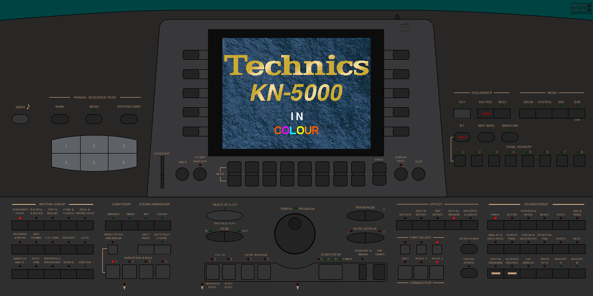
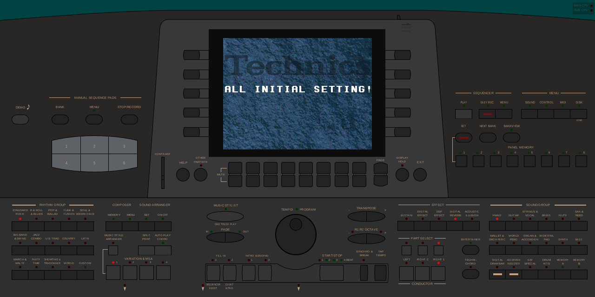
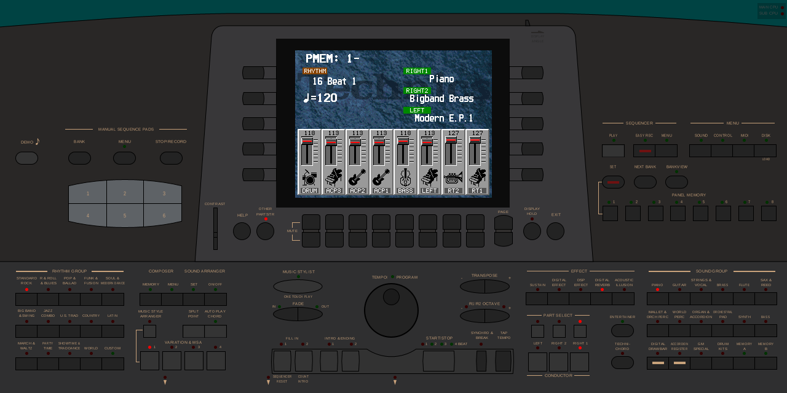

# KN5000 boot splash restored — by letting the firmware's power-down code run

*2026-08-15. Acceptance test: `tools/tests/test_kn5000_splash.sh` (two boots sharing an NVRAM
directory). Quest: `side-quests/pending/kn5000_splash_animation.txt`.*

## Result

**Both halves of the acceptance criterion are met, with no hack.** After a clean power-off
through the modelled POWER switch, the next boot shows the splash *and* real sound names. No
write tap, no faked checksum: the firmware's own power-off code runs and its own boot code
restores what it saved.

| | warm boot (after a clean power-off) | cold boot (empty NVRAM) — the control |
|---|---|---|
| screen at t=12 |  |  |
| | **"Technics KN-5000 IN COLOUR"** | **"ALL INITIAL SETTING!"** |

Home screen on the warm boot, showing the names still resolve:



`RIGHT1 Piano` · `RIGHT2 Bigband Brass` · `LEFT Modern E.P.1` — no "Sound Name Error", so
this does not regress the kn5000-29 fix.

## Why it was blocked, and what changed

MAME's `schedule_exit()` calls `eat_all_cycles()`, so **no maincpu cycles run after shutdown is
scheduled** and any EXIT notifier fires after NVRAM is already written. The firmware's power-off
handler could never execute, so nothing was ever saved to persist.

Power-off is now a **machine control** rather than the emulator's exit. Pressing it pulses the
CPU's NMI (edge-triggered in `tmp94c241_device::execute_set_input`) and delays
`schedule_exit()` by `POWER_DOWN_MS`, giving the firmware its power-down window. The driver
writes no checksums and no NVRAM.

## The chain, each link measured

```
POWER pressed
  -> NMI  -> NMI_StorePayloadChecksums (0xEF08D4), guarded by 0x0400 == 0x80
             ARMED BY THE FIRMWARE at t=7.69 from PC=0xEF0634  [kn5000_nmiguard.lua]
  -> checksums into DRAM 0xFFD4 / 0xFFD2
  -> copy DRAM[0xF980..0xFFEE] -> IC21 battery-backed SRAM 0x1E8000
             823 writes into 0x1E8000..0x1E8FFE  = 0x337 words, EXACTLY the length the
             handler computes (0x66E >> 1)        [kn5000_poweroff.lua]
  -> MAME exits; nvram/kn5000/nvram holds the block
             577 non-trivial bytes at +0x8000     [test_kn5000_splash.sh]
NEXT BOOT
  -> 0x5AA5 magic absent at 0xFFCA (work DRAM is volatile) -> restore 0x1E8000 -> 0xF980
  -> checksum timeline                            [kn5000_warmboot.lua]
             t=0.02  0xFFD4=0x0000  0xFFD2=0x0000     cold DRAM
             t=0.07  0xFFD4=0xD03A  0xFFD2=0x612F     <- RESTORED
             t=7.59  0xFFD4=0x0000  0xFFD2=0x612F     cleared later, after the verify
     cold-boot control: only the t=0.02 line ever appears
  -> SubCPU_Payload_Verify (0xEF092B) can pass -> SPLASH
```

**The firmware is written for volatile DRAM.** The `0x5AA5` guard means the restore runs on a
cold start and is skipped on a warm one. That independently vindicates the earlier removal of
the `share("nvram1")` on the work DRAM — the two changes fit together rather than fighting.

## Honest limits

* **`POWER_DOWN_MS = 100` is not a hardware measurement.** It is a generous upper bound; the
  handler's work is far under a millisecond at this clock. If a real figure ever arrives,
  replace it and say so.
* **The internal branch was not observed, only the outcome.** I verified the splash appears and
  the names resolve; I did not tap `SubCPU_Payload_Verify` to watch it take the skip. The
  acceptance criterion is about the outcome, but the stronger claim would need that tap.
* **The control covers the screen, not the audio.** Nothing here says the sub-CPU is in an
  identical state to a cold boot — only that sound names resolve.
* Two of my own instrument bugs are recorded in the rigs, because both produced confident wrong
  readings first: a tap range ending on an even address (fatal on this 16-bit bus), and
  sampling the checksums once at t=32 when the verify runs at t≈4, which reported "cold path"
  from values that were merely stale.

## Does the pattern transfer to the MN10300 models? Not on the evidence so far

I claimed the technique is reusable "for any model with a power-fail routine". That is true as
stated, but the antecedent has to be checked per model, and for the KN7000 it does **not**
obviously hold.

The KN7000's vector table has only two populated entries (everything from `0x48400010` is `0xFF`
filler):

```
48400000: jmp 0x4840FF7E     reset
4840000A: jmp 0x484D77CF     second vector
```

`0x484D77CF` is an **I/O initialisation** routine, not a state save — it writes on-chip I/O
registers (`0x34001092` <- 0xFFFF, `0x34001082` <- 0x82, `0x9000000E` <- 0, bit clears on
`0x36008004`) and calls into further setup. Nothing resembling the KN5000's
"checksum-and-copy-to-battery-backed-SRAM" transaction.

That fits the architectures being different: the KN5000's mechanism exists to serve its
**sub-CPU payload** design (skip the transfer next boot if the checksums still match), and the
KN7000 has no equivalent payload handshake. It also has no recorded symptom of a missing
power-down transaction — no `<Db>`-style artefact, no missing splash.

**So: no KN7000 work is implied by this.** The pattern is available if a power-fail routine is
ever found in one of these firmwares, and the check is cheap (look at the vector table, see
whether the handler saves state or configures hardware). Recorded so the "reusable" note above
is not read as a to-do.

## Reproduce

```
./tools/tests/test_kn5000_splash.sh          # 3 checks, two boots, ~4 min
./tools/tests/test_kn5000_splash.sh --keep   # keep the NVRAM dir, logs and snapshots
```
